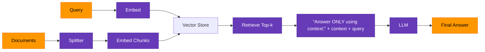
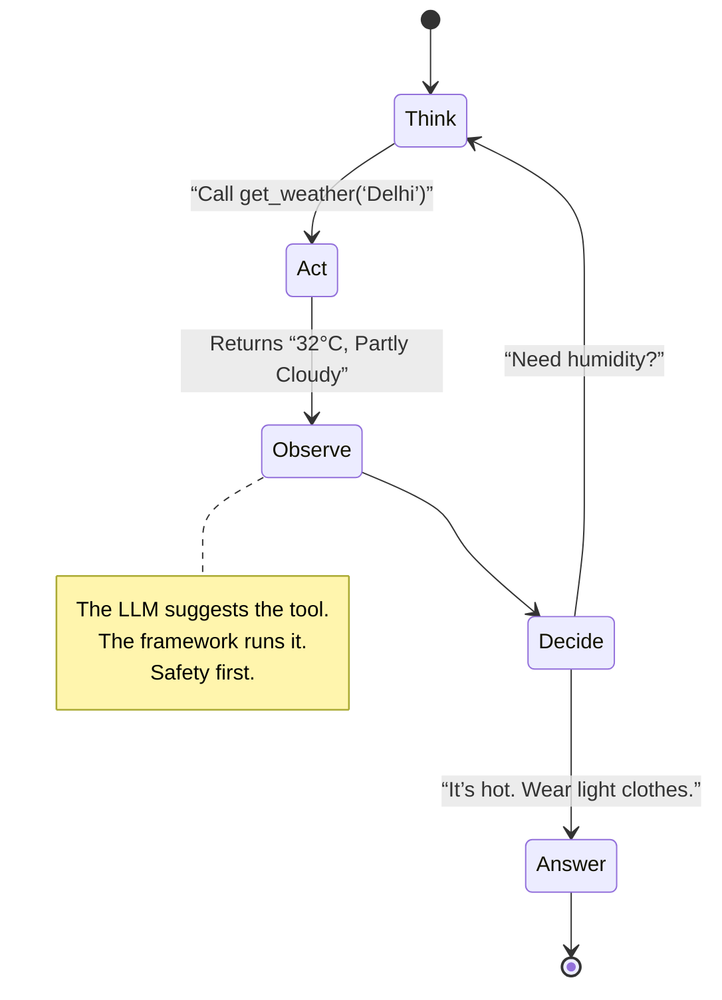

# 🧠 LangChain Journey  
*by ayushsyntax*

> *A personal learning lab where I explore LangChain concepts, RAG pipelines, and agent workflows through hands-on experiments.*

---

## 🔍 What This Is

This is my **working notebook repository** — not a polished library or tutorial.  
I built it to:

- ✅ Learn by doing: Each `.ipynb` starts with a question I wanted to answer.
- ✅ Document my path: From “How do I call a model?” to “How do I build an agent?”
- ✅ Keep what worked — and what broke: Failures are annotated, not deleted.
- ✅ Create a reference I can revisit when I forget how `RunnableParallel` works.

No corporate speak. No “revolutionary” claims. Just code, notes, and progress.

---

## 🗂️ How It’s Organized

```
LangChain_Journey/
│
├── 🏗️ core/             # Foundations
│   ├── Introduction_to_LangChain.ipynb     # First steps
│   ├── Models_1.ipynb                       # Calling LLMs & ChatModels
│   └── Prompts_2.ipynb                      # Templates, roles, dynamic prompts
│
├── ⛓️ orchestration/    # Chaining & Flow
│   ├── Chains_in_LangChain_5.ipynb          # LCEL basics
│   ├── What_are_Runnables_6.ipynb           # Standard invoke() interface
│   └── Output_Parsers_4.ipynb               # Pydantic, StringOutputParser
│
├── 📑 data/              # Loading & Structuring
│   ├── Document_Loaders_RAG1.ipynb          # PDF, Web, CSV → Documents
│   ├── Text_Splitters_RAG2.ipynb            # Chunking for context limits
│   └── Vector_Stores_RAG3.ipynb             # Embeddings + Chroma/FAISS
│
├── 🔍 rag/               # Retrieval-Augmented Generation
│   ├── Retrievers_RAG4.ipynb                # Semantic search, MMR, compression
│   └── RAG_Pipeline_Complete.ipynb          # End-to-end implementation
│
└── 🤖 agents/            # Tool Calling & Autonomous Workflows
    ├── Tools_Calling_in_LangChain.ipynb     # @tool, binding, safe execution
    └── Building_end_to_end_AI_Agent.ipynb   # ReAct loop with AgentExecutor
```

---

## 🧩 Key Concepts I’ve Implemented

### 1. **Models & Prompts**
- Learned difference between `LLM` (string-in/string-out) and `ChatModel` (message-based)
- Used `ChatPromptTemplate` with `SystemMessage`, `HumanMessage`, `AIMessage`
- Controlled output randomness with `temperature=0` (deterministic) vs `temperature=1.5` (creative)

→ [`Models_1.ipynb`](Models_1.ipynb) · [`Prompts_2.ipynb`](Prompts_2.ipynb)

### 2. **Runnables & LCEL**
- Understood `Runnable` interface — everything has `.invoke()`
- Built chains with `|` operator: `prompt | model | parser`
- Used `RunnableParallel` to fetch context + pass original question simultaneously

→ [`What_are_Runnables_6.ipynb`](What_are_Runnables_6.ipynb) · [`Chains_in_LangChain_5.ipynb`](Chains_in_LangChain_5.ipynb)

### 3. **Structured Output**
- Used `PydanticOutputParser` to enforce schema (e.g., `age: int > 0`)
- Injected format instructions into prompts via `partial_variables`
- Prevented hallucinations by validating output before use

→ [`Output_Parsers_4.ipynb`](Output_Parsers_4.ipynb)

### 4. **RAG Pipeline**

- Used `RecursiveCharacterTextSplitter` to preserve sentence boundaries
- Added `ContextualCompressionRetriever` to trim irrelevant text before LLM input

→ [`RAG_Pipeline_Complete.ipynb`](RAG_Pipeline_Complete.ipynb)

### 5. **Agents & Tools**

- Defined tools with `@tool` decorator
- Bound tools to model with `model.bind_tools([get_weather])`
- Used `AgentExecutor` for simple ReAct loops (no LangGraph yet)

→ [`Tools_Calling_in_LangChain.ipynb`](Tools_Calling_in_LangChain.ipynb) · [`Building_end_to_end_AI_Agent.ipynb`](Building_end_to_end_AI_Agent.ipynb)

---

## 🛠️ My Setup

| Component | Choice |
|----------|--------|
| **LangChain** | v1.0 (core only — no LangGraph yet) |
| **Python** | 3.14.2 |
| **Environment** | JupyterLab 4.x |
| **Models** | OpenAI (`gpt-4o`), Ollama (`llama3.1`) |
| **Vector DB** | Chroma (local), FAISS (for testing) |

> ✅ All notebooks run locally  
> ✅ Code comments explain *why*, not just *how*  
> ✅ Failed attempts are kept — with notes on what went wrong

---

## 📜 A Note to My Future Self

> *When you come back here:*  
> - Don’t skip the messy cells. That’s where you figured things out.  
> - Re-read the `agent_executor.ipynb` failures — they taught you about tool safety.  
> - Remember how `RunnableParallel` clicked when you needed to pass the original question.  
>  
> You’re not done. You’re just getting started.  
> — Current You

---

<div align="center">

[](https://github.com/ayushsyntax/LangChain_Journey)  
**LangChain isn’t magic. It’s patterns.  
This is where I’m learning them.**

</div>
