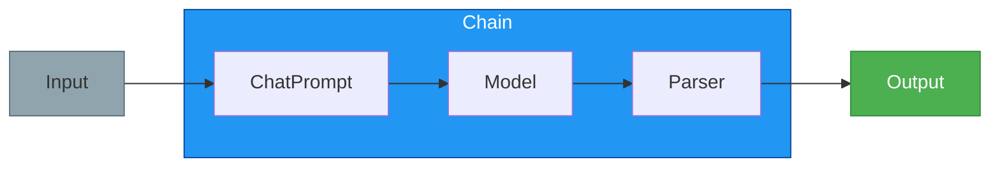
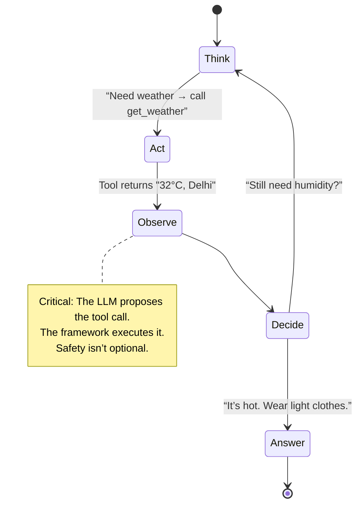

---

# 🧠 LangChain Journey  
*by ayushsyntax*

> *A living log of building, breaking, and understanding LangChain — from first `invoke()` to autonomous agents.*

---

## 🌱 Why This Exists

This repo is my **engineering journal** — not a tutorial, not a template.  
It’s where I:

- ✍️ **Write to learn**: Every notebook starts with a question, not a conclusion.  
- 🔧 **Break things on purpose**: To see how they’re held together.  
- 📦 **Build from scratch**: Even when higher abstractions exist — because primitives teach truth.  
- 🧭 **Map the mental model**: Not just *how*, but *why* the pieces click.

> *“If you can’t rebuild it, you don’t own it.”*

---

## 🗺️ My LangChain Path — Visualized


Each phase wasn’t linear — it was **looped, revisited, debugged at 2 AM**.  
And that’s exactly what the notebooks show.

---

## 🧪 What’s Inside — As I Learned It

### 1. **Foundations: Speaking the Model’s Language**
- `ChatModel` vs `LLM` — why roles (`System`, `Human`, `AI`) changed everything  
- `temperature=0` for reproducibility, `temperature=1.3` for brainstorming  
- Prompt templating that *doesn’t break* when history grows  
→ [`models.ipynb`](core/models.ipynb) · [`prompts.ipynb`](core/prompts.ipynb)

### 2. **The Runnable Revelation**
> *“Wait — everything has `.invoke()`? Even my lambda?”*

- Unified interface over models, prompts, parsers, tools  
- `RunnableLambda(lambda x: x["query"].upper())` — my first “aha!” moment  
→ [`runnables.ipynb`](core/runnables.ipynb)

### 3. **LCEL: Where Code Became Flow**

```python
chain = prompt | model | StringOutputParser()
# No wrapper classes. Just flow.
```
→ [`lcel.ipynb`](orchestration/lcel.ipynb)

### 4. **Structured Output: Taming the LLM**
- `PydanticOutputParser` with `Field(gt=0, le=100)` → stopped `"age": "infinity"`  
- Schema injection into prompts via `partial_variables`  
→ [`parsers.ipynb`](io/parsers.ipynb)

### 5. **RAG: Grounding in Reality**
```
[Query] 
   ↓
[Embed → Retrieve] → [“Use ONLY this: …” + Context + Query] 
   ↓
[Model] → [Answer with Sources]
```
- `RecursiveCharacterTextSplitter` — because `chunk_size=1000` lies  
- `ContextualCompressionRetriever` — trimming fluff *before* it hits the LLM  
→ [`pipeline.ipynb`](rag/pipeline.ipynb)

### 6. **Agents: My First Autonomous Loop**

- `@tool` decorator → turned a function into an “agent limb”  
- `AgentExecutor` — my first working ReAct loop (with retries)  
→ [`agent_executor.ipynb`](agents/agent_executor.ipynb)

---

## 🧰 My Toolkit

| Layer | Tools Used |
|-------|------------|
| **Models** | OpenAI (`gpt-4o`), Anthropic (`claude-3.5`), Ollama (`llama3.1`) |
| **Vector DB** | Chroma (dev), FAISS (lightweight tests) |
| **Orchestration** | LangChain v1.0 core — `Runnable`, `LCEL`, `AgentExecutor` |
| **Env** | JupyterLab 4.x · Python 3.14.2 |

> ✅ All notebooks are **runnable as-is**  
> ✅ Comments explain *intent*, not just syntax  
> ✅ Failures are kept — with notes on *why*

---

## 📜 A Note to My Future Self

> *Hey future me,*  
> When you open `agent_executor.ipynb` and see the 7 failed loops before the 8th worked —  
> **don’t skip them.**  
> That’s where the real learning is.  
> The working version is the trophy.  
> The broken ones? That’s the training data.  
>  
> Keep building. Keep breaking.  
> — You, 2025

---

<div align="center">

[](https://github.com/ayushsyntax/LangChain_Journey)  
**LangChain isn’t magic — it’s legos with documentation.  
This is my assembly log.**

</div>
