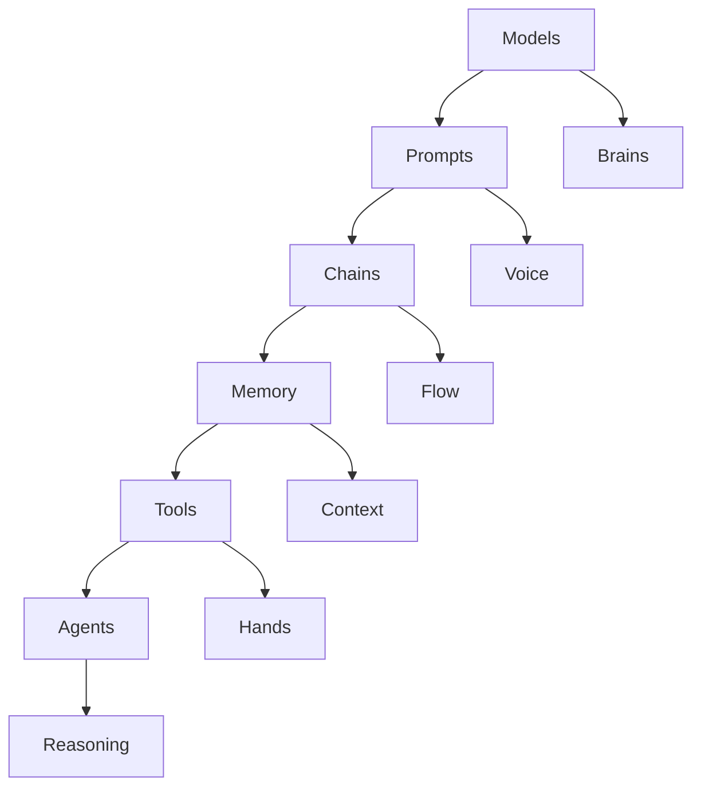
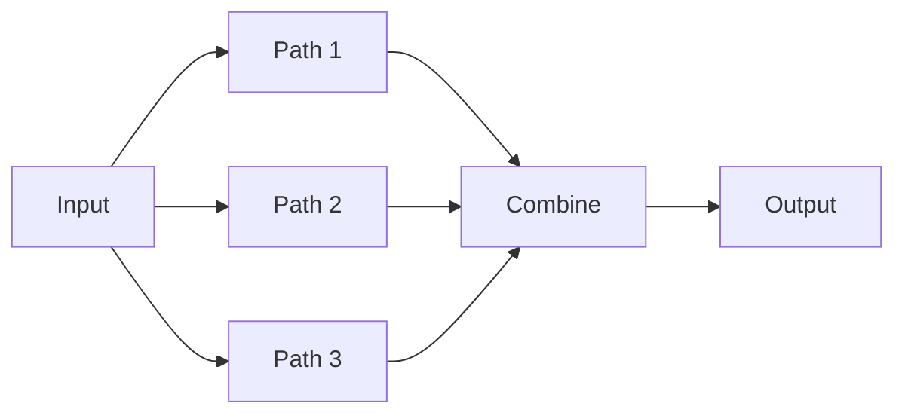

# 🧠 LangChain_Journey

*By ayushsyntax*

<div align="center">

[](https://python.langchain.com/)
[](https://www.python.org/)
[](https://jupyter.org/)

**My Personal Learning Laboratory** 🚀  
*From Zero to Autonomous AI Systems*

</div>

---

## 🌱 **Personal Learning Diary**

This is my **engineering notebook** — documenting my journey from basic concepts to building intelligent systems. Each notebook represents a **milestone** in understanding how AI applications actually work under the hood.

> **"Build to understand. Break to learn. Connect to create."**

---

## 📂 **Repository Structure**

```
LangChain_Journey/
│
├── Introduction_to_LangChain.ipynb
│   └── Core concepts and mental model
│
├── Models_1.ipynb
│   └── Calling LLMs, temperature, chat vs completion
│
├── Prompts_2.ipynb
│   └── Prompt templates and message roles
│
├── Structured_Output_3.ipynb
│   └── Schema-based output with Pydantic
│
├── Output_Parsers_4.ipynb
│   └── Parsing structured and unstructured outputs
│
├── Chains_in_LangChain_5.ipynb
│   └── LCEL and chain composition
│
├── Document_Loaders_RAG1.ipynb
│   └── Loading external data sources
│
├── Text_Splitters_RAG2.ipynb
│   └── Chunking strategies for LLM context
│
├── Retrieval_Augmented_Generation_What_is_RAG.ipynb
│   └── End-to-end RAG explanation
│
├── Retrievers_RAG4.ipynb
│   └── Vector search and retrieval logic
│
├── Tools_Calling_in_LangChain.ipynb
│   └── Tool definition and invocation
│
├── Building_end_to_end_AI_Agent_in_LangChain.ipynb
│   └── Agent reasoning and execution flow
│
├── What_are_Runnables_6.ipynb
│   └── Runnable abstraction and LCEL
│
└── README.md
```

---

## 📓 **Learning Path**

### 🏗️ **Phase 1: Foundations** 
- `Introduction_to_LangChain.ipynb` - Core concepts and mental model
- `Models_1.ipynb` - LLMs, Chat Models, temperature controls
- `Prompts_2.ipynb` - Templates, message roles, dynamic prompts

### 🔗 **Phase 2: Orchestration**
- `Chains_in_LangChain_5.ipynb` - LCEL, composition patterns
- `What_are_Runnables_6.ipynb` - Runnable abstraction
- `Output_Parsers_4.ipynb` - Structured output handling

### 📚 **Phase 3: Retrieval Systems**
- `Document_Loaders_RAG1.ipynb` - Data ingestion
- `Text_Splitters_RAG2.ipynb` - Context management  
- `Retrievers_RAG4.ipynb` - Vector search
- `Retrieval_Augmented_Generation_What_is_RAG.ipynb` - Complete pipeline

### 🤖 **Phase 4: Autonomous Systems**
- `Structured_Output_3.ipynb` - Schema validation
- `Tools_Calling_in_LangChain.ipynb` - Tool integration
- `Building_end_to_end_AI_Agent_in_LangChain.ipynb` - Agent reasoning

---

## 🧩 **Core Understanding**

### 🔧 **Building Blocks**

| **Component** | **Function** | **Key Insight** |
|:---|:---|:---|
| **Runnables** | Standardized execution units | Everything connects uniformly |
| **LCEL** | `Prompt | Model | Parser` | Functional AI programming |
| **Models** | LLMs & Chat Models | Context + Instructions = Output |
| **RAG** | Retrieval + Generation | Grounded responses from private data |
| **Agents** | Reasoning + Action | Autonomous task execution |

---

## 🖼️ **Visual Architecture**

### 🧠 **System Mental Model**


### 🔗 **Chain Execution Flow**
```
User Input → [Prompt] → [Model] → [Parser] → Output
```

### 🤖 **Agent Reasoning Loop**
```
THINK → ACT → OBSERVE → REPEAT
```

### 🎯 **RAG Pipeline**
```
Query → Embed → Search → Context + Query → Answer
```

### 🔄 **Parallel Execution Pattern**


---

## 🧩 **Topics Covered**

### ✅ Core LangChain Concepts
* Chat models vs LLMs
* Prompt templates and message roles
* Temperature and determinism
* LCEL execution model

### ✅ Chains & Runnables
* Sequential and parallel execution
* `RunnableLambda`, `RunnableBranch`
* Data flow between components
* Functional composition

### ✅ Structured Outputs
* `PydanticOutputParser`
* Schema validation
* Controlled LLM responses

### ✅ Retrieval-Augmented Generation (RAG)
* Document loading
* Text chunking
* Embeddings & vector stores
* Context-aware generation
* Hallucination reduction

### ✅ Tool Calling & Agents
* Tool registration and binding
* Safe execution model
* ReAct-style reasoning
* End-to-end agent workflows

---

## 🧪 **Learning Methodology**

### **My Process**
1. **Build manually** - Every concept from scratch
2. **Break intentionally** - Debugging teaches more than success
3. **Document insights** - Notes for future understanding
4. **Iterate constantly** - Refine and expand knowledge

### **Design Philosophy**
* Understand systems, not just APIs
* Prefer explicit data flow
* Avoid hidden abstractions
* Treat LLMs as components, not magic
* Learn by building and breaking

This repository reflects **learning in motion**, not a polished library.

---

## 💭 **Personal Reflection**

*Remember the breakthrough moments when RunnableParallel clicked, when your first agent called a tool successfully. Those came from persistence through confusion. Keep walking toward what feels hard — that's where growth lives.*

*— Past Me*

---

## 📊 **Progress Tracking**

```
 foundations: ████████████████████ 100% Complete
 orchestration: ████████████████░░ 80% Active
 retrieval: ████████████░░░░░░░░ 60% In Progress
 agents: ████████░░░░░░░░░░░░░░ 40% Exploring
 production: ████░░░░░░░░░░░░░░░░ 20% Planning
```

---

## 🎨 **Core Philosophy**

**"Understand Systems. Build Components. Create Intelligence."**

Every breakthrough emerges from connecting concepts in new ways. Every innovation starts with understanding the fundamental pieces.

---

